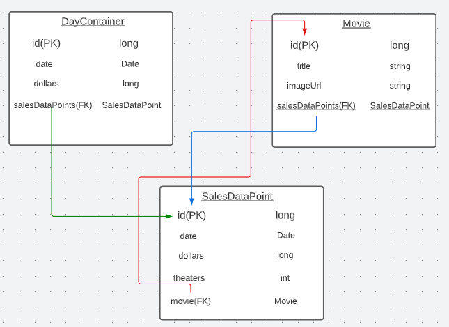

<h1>Box Office Tracker</h1>

An application that recreates daily box office data and organizes it to look at the sales on a year-over-year basis.

# Notes

<li>Exposes API to calculate the relative performance of the current year's box office relative to a given prior year.</li>
<li>Paging and sorting repository to analyze to the success or failure of specific release schedules.</li>
<li>Track number of theater-days (theaters * days) of movie releases</li>
<li>Data from <a>BoxOfficeMojo.com</a></li>
<li>Stores data to in-memory database with H2</li>
<li>Runs recurrently every hour to check for updates to push to database.</li>

# Schema

# Frontend

Front end is part of a multi-project front end at the link below.

https://github.com/Ulatec/MultiProjectFrontend
